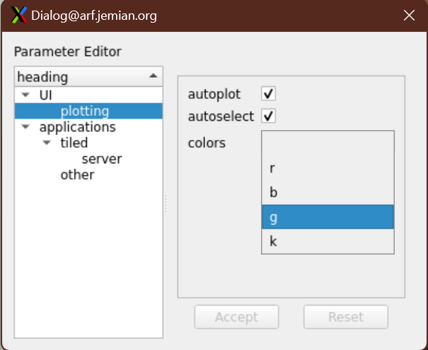

# pyQParamWidget: PyQt5 Parameter Editor Widgets

A PyQt5 QWidget and QDialog to edit application parameters.

```py
import pyqparamwidget as qpw
```



```text
# -----------------------------------------------------------------------------
# :author:    Pete R. Jemian
# :email:     prjemian@gmail.com
# :copyright: (c) 2024, Pete R. Jemian
#
# Distributed under the terms of the Creative Commons Attribution 4.0 International Public License.
```
