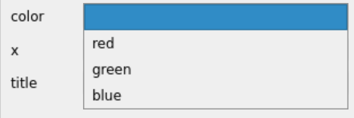

===========
User Guide
===========

This package simplifies the construction of a ``QWidget`` for the user to edit a
set of parameters (of a PyQt5 application.)  It provides a single
:ref:`guide.ParameterEditor` screen for editing a set of
:ref:`guide.ParameterItem` objects and a :ref:`guide.ParameterTree`
dialog for editing a hierarchical structure with various sets of parameters.

.. _guide.ParameterItem:

Parameter Items
==========================

An individual *parameter* item has several pieces of information, as described
in the source code documentation, see
:class:`~pyQParamWidget.param_item.ParameterItemBase`. There are different
types, depending on the type of parameter to be edited.  Here is an example of a
*dictionary of Parameter Items*.

.. rubric:: Example dictionary of Parameter Items

.. code-block:: python
    :linenos:

    import pyQParamWidget as qpw
    parms = {
        "title": qpw.ParameterItemText("title", "Suggested title"),
        "color": qpw.ParameterItemChoice(
            "color",
            "",
            choices=["", "red", "green", "blue"],
            tooltip="Pick a color.",
        ),
        "autoscale": qpw.ParameterItemCheckbox(
            "autoscale",
            True,
            tooltip="Otherwise, not autoscale.",
        ),
    }

The Parameter Item types are listed next:

``ParameterItemCheckbox``
------------------------------------

.. code-block:: python

    ParameterItemCheckbox(
        "autoscale", True, tooltip="Otherwise, not autoscale."
        )

.. rubric:: Example widget to edit a ParameterItemCheckbox.

.. figure:: _static/ParameterItemCheckbox.png
   :width: 40%

   Example widget to edit a ``ParameterItemCheckbox``.

``ParameterItemChoice``
------------------------------------

.. code-block:: python

    ParameterItemChoice(
        "color", "",
        choices=["", "red", "green", "blue"],
        tooltip="Pick a color.",
        )

.. rubric:: Example widget to edit a ParameterItemChoice.

   Example widget to edit a ``ParameterItemChoice``.  Drop-down
   menu is selected to show the list of choices.

``ParameterItemIndex``
------------------------------------

.. code-block:: python

    ParameterItemIndex(
        "x", 50,
        hi=100,
        lo=0,
        tooltip="Choose a value from the range.",
        )

.. rubric:: Example widget to edit a ParameterItemIndex.

.. figure:: _static/ParameterItemIndex.png
   :width: 40%

   Example widget to edit a ``ParameterItemIndex``.

``ParameterItemText``
------------------------------------

.. code-block:: python

    ParameterItemText("title", "Suggested title", tooltip="Set the title. Be brief.")

.. rubric:: Example widget to edit a ParameterItemText.

.. figure:: _static/ParameterItemText.png
   :width: 40%

   Example widget to edit a ``ParameterItemText``. The tooltip is also shown.

.. _guide.ParameterEditor:

Parameter Editor
==================================

A parameter dictionary can be edited with a
:class:`~pyQParamWidget.param_editor.ParameterEditor()` widget. 

.. seealso:: :ref:`guide.ParameterTree`

Here is one example.

.. rubric:: View of a parameter dictionary using ParameterEditor

.. figure:: _static/editor.png
   :width: 60%

   View of ``ParameterEditor`` dialog.

.. rubric::  Full Python application to display parameters in a ParameterEditor widget

.. code-block:: python

    """Parameters Editor Demo Application"""
    import sys

    from PyQt5 import QtWidgets
    import pyQParamWidget as qpw

    # build the dictionary
    parameters = {
        "settings_file": qpw.ParameterItemText(
            label="settings file", value="settings.ini"
        ),
        "server": qpw.ParameterItemChoice(
            label="server URL",
            value="http://localhost",
            choices=[
                "http://localhost",
                "http://localhost.localdoman",
                "http://127.0.0.1",
            ],
        ),
        "autoconnect": qpw.ParameterItemCheckbox(
            label="Autoconnect with server?", value=True
        ),
        "catalog": qpw.ParameterItemText(label="catalog", value="my_catalog"),
        "autoopen": qpw.ParameterItemCheckbox(
            label="Auto open catalog?", value=True
        ),
    }

    # Show ParameterEditor in a PyQt application
    app = QtWidgets.QApplication(sys.argv)
    window = qpw.ParameterEditor(None, parameters)
    window.show()
    print(f"{window.widgetValues()=}")
    sys.exit(app.exec())

For the source code documentation, see
:class:`~pyQParamWidget.param_editor.ParameterEditor`.

.. rubric:: EXAMPLE

First make a dictionary of
:class:`~pyQParamWidget.param_item.ParameterItem` objects.
The keys of the dictionary can be strings or Python objects or
any other structure allowed by Python as dictionary keys.  The
keys, themselves, are not used by ``ParameterEditor``.  They
are only used to identify each of the ``ParameterItem`` objects.

This example defines three objects:

.. code-block:: python
    :linenos:

    parameters = {
        "title": qpw.param_item.ParameterItemText(
            "title",
            "Suggested title",
            tooltip="Set the title. Be brief."
            ),
        "color": qpw.param_item.ParameterItemChoice(
            "color",
            "",
            choices=["", "red", "green", "blue"],
            tooltip="Pick a color.",
        ),
        "autoscale": qpw.param_item.ParameterItemCheckbox(
            "autoscale",
            True,
            tooltip="Otherwise, not autoscale.",
        ),
    }

Next, create the ``ParameterEditor`` object, passing in the ``parent``
object (usually the ``QWidget`` object that will contain this new widget) and
the ``parameters`` dictionary.

.. code-block:: python

    editor = ParameterEditor(parent, parameters)

Finally, add ``editor`` into parent's layout.

.. _ug:alert:

Accept and Reset buttons
------------------------

The buttons for **Accept** and **Reset** are enabled when the values
in the editor are different than the supplied parameters.

Before the window can be closed, it is necessary to either **Accept** all
changes or **Reset** all widgets to supplied parameters values.

.. rubric:: View of a ParameterEditor widget with changes.

.. figure:: _static/has-changes.png
   :width: 60%

   View of ``ParameterEditor`` widget with changes.

This dialog will be shown if the editor window is requested to close while
changes have not been resolved.

.. rubric:: Alert when request to close editor window with unresolved changes.

.. figure:: _static/alert.png
   :width: 60%

   Alert message when trying to close ``ParameterWidget`` with changes.

.. rubric:: Accept

When pressed, the **Accept** button *updates the supplied parameters* from the
widgets.

.. rubric:: Reset

When pressed, the **Reset** button *updates the widgets* from the supplied
parameters.

.. _guide.ParameterTree:

Parameter Tree
==================================

A *hierarchy* of parameters can be edited using the
:class:`~pyQParamWidget.param_tree.ParameterTree()` dialog. 

.. seealso:: :ref:`guide.ParameterEditor`

Here is one example.

.. rubric:: View of a hierarchical parameter dictionary using ParameterTree

.. figure:: _static/qpw.png
   :width: 60%

   View of ``ParameterTree`` dialog.

The *hierarchy* (a dictionary of dictionaries) is displayed as a tree on the
left side.  The keys are text strings, to be displayed in the tree.  The end of
each branch of the tree is a dictionary of Parameter Items.  See the next block
of Python code.  When the end of a branch is selected, a :ref:`guide.ParameterEditor`
is shown in the right side of the dialog.

.. rubric:: Python code to construct the example hierarchical parameter dictionary

.. code-block:: python
    :linenos:

    import pyQParamWidget as qpw

    hierarchy = {
        "applications": {
            "tiled": {
                "server": {
                    "settings_file": qpw.ParameterItemText(
                        label="settings file", value="~/.config/settings.ini"
                    ),
                    "catalog": qpw.ParameterItemText(label="catalog", value="bluesky_data"),
                    "url": qpw.ParameterItemText(label="url", value="http://localhost"),
                },
            },
            "other": {
                "demo": qpw.ParameterItemCheckbox("demo mode?", True),
            },
        },
        "UI": {
            "plotting": {
                "autoplot": qpw.ParameterItemCheckbox(
                    label="autoplot",
                    value=True,
                    tooltip="Plot when the run is selected.",
                ),
                "autoselect": qpw.ParameterItemCheckbox(
                    label="autoselect",
                    value=True,
                    tooltip="Automatically select the signals to plot.",
                ),
                "colors": qpw.ParameterItemChoice(
                    label="colors", value="", choices=["", "r", "b", "g", "k"]
                ),
            },
        },
    }

.. rubric::  Python code to display the hierarchy in a ParameterTree dialog

.. code-block:: python
    :linenos:

    dialog = qpw.ParameterTree(None, parameters=hierarchy)
    # dialog.show()  # modeless: does not block
    dialog.exec()  # modal: blocks
    # Show the final values of the parameters, once the dialog is closed.
    print(f"{dialog.values()=}")

An alert will be shown (see :ref:`ug:alert`) if the editor has changes. It will
not be possible to select another item from the tree until the changes are
resolved.

.. rubric:: Alert message when selecting another tree item while editor has changes.

.. figure:: _static/tree-with-changes.png
   :width: 60%

   Editor shown for ``other`` parameters. After the checkbox was changed, the
   ``server`` was selected.  This brings up the *Alert* message, stating that
   changes must first be resolved.  Once the dialog is closed, the selected item
   will be changed back to ``other``.
